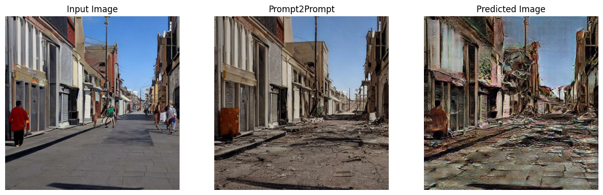

# CS413-Computational-Photography
Project of CS413 - Computational Photography course on TimeWarp, Spring 2023

Authors: Juliette Parchet, Camille Montemagni, Marino Müller

# Prerequesits
- First you need to download the dataset from this [link](https://drive.google.com/uc?export=download&id=1oS67xo1ti2JCGPZAq9G7M213-i1VxO6I) and save it as `./Data/Dataset.zip`. 
- Next you need to download the pretrained weights folder from this [link](https://drive.google.com/uc?export=download&id=1z4NKPolPDfeEI3njuIFvbDQvMIQk9Nhl) and save it in ./checkpoints/. Then unzip the folder with `unzip ./checkpoints/checkpoint_pretrained.zip`. Check you have now a non-empty folder `./checkpoints/checkpoint_pretrained/`.
- Install the needed packages `pip install -r requirements.txt`

**Note:** Tested on Python 3.8.7

# Usage

- Use `pretrained_model_showcase.ipynb` if you want to load our pretrained model and gerate some show case images.
- With `train_the_model.ipynb` you can train the model with our dataset or your own dataset yourself. You will need to edit the paths according to your dataset and checkpoint directories you want to use.
- In the notebook `model_evaluation_with_CLIP.ipynb` we evaluated the prediction of our model with CLIP.

# Results

## Prompt2Prompt
Here you see a comparison between Prompt2Prompt and our model, when trying to predict how an image would look like when it was abandoned for 100 years (time warp).
Note: In Prompt2Prompt the input image is also generated with the Prompt2Prompt model. 

## Real life Photographs
Here you see some examples of real world photographs we took and let our model predict how the time warp would look like.

